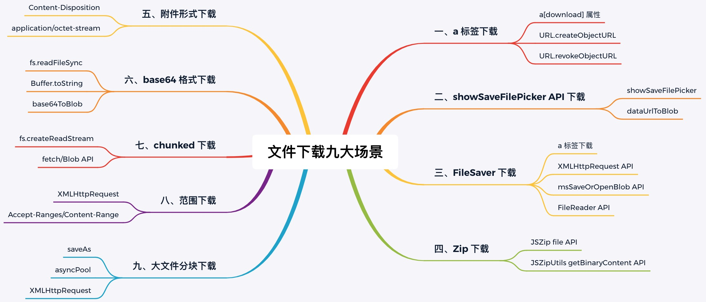
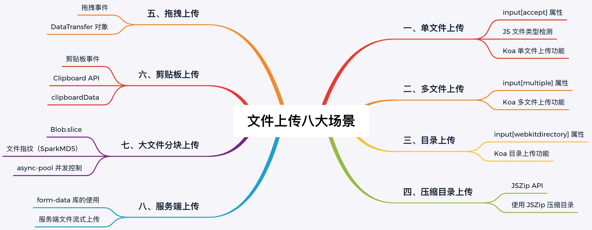

## 多场景文件下载示例

### 一、项目简介

在日常生活中，文件下载是一个很常见的功能，本项目阿宝哥演示了文件下载的 9 种场景：



如果你对文件上传感兴趣的话，可以阅读 [文件上传，搞懂这8种场景就够了](https://mp.weixin.qq.com/s/aRfDFVpDFftn1qFYeLg4Iw)。8 种场景对应的示例：[file-upload-demos](https://github.com/semlinker/file-upload-demos)



### 二、项目使用

#### 2.1 项目初始化

1、克隆项目

```shell
git clone https://github.com/semlinker/file-download-demos.git
```

2、安装依赖

```shell
npm install
```

#### 2.2 目录结构说明

```shell
├── README.md
├── a-tag # a标签下载
├── attachment # 附件下载
├── base64 # base64下载
├── big-file # 大文件分块下载
├── chunked # chunked下载
├── file-saver # FileSaver下载
├── images # 图片资源文件
├── jszip # Zip下载
├── range # 范围下载
└── save-file-picker # showSaveFilePicker下载
```

#### 2.3 运行 a 标签下载示例

```shell
npm run atag
```

#### 2.4 运行 showSaveFilePicker API 下载示例

```shell
npm run picker
```

#### 2.5 运行 FileSaver 下载示例

```shell
npm run saver
```

#### 2.6 运行 Zip 下载示例

```shell
npm run zip
```

#### 2.7 运行附件形式下载示例

```shell
npm run attachment
```

#### 2.8 运行 base64 格式下载示例

```shell
npm run base64
```

#### 2.9 运行 chunked 下载示例

```shell
npm run chunked
```

#### 2.10 运行范围下载示例

```shell
npm run range
```

#### 2.11 运行大文件分块下载示例

```shell
npm run big
```